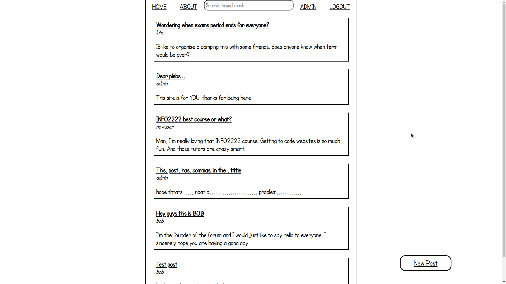
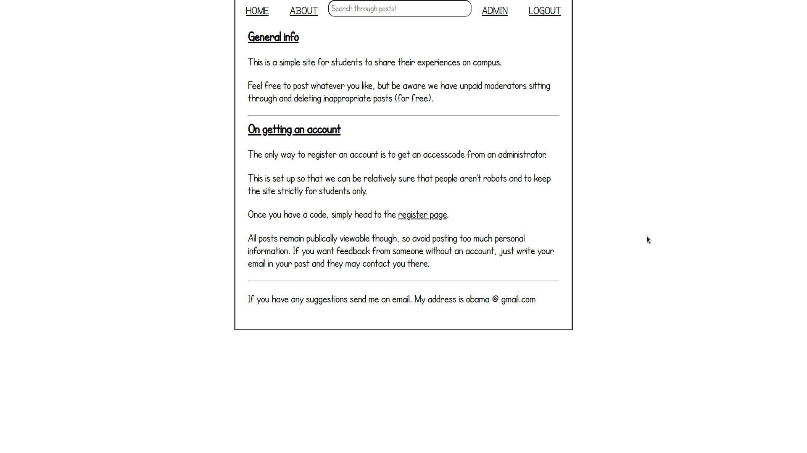

# Forum server made with Go
An invite only forum made in go I made over the weekend.

## Features
- csv database of users
- users can make posts and comments
- invite system
- admins can delete comments, ban users, add/remove invite codes

## Screenshots

